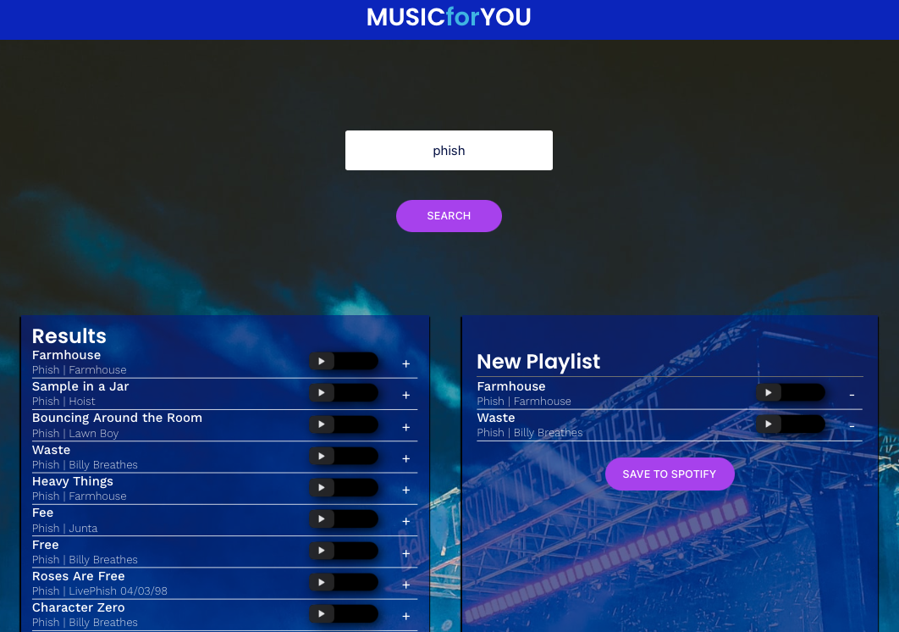

# Mark Novak
> This is a React app that can be used by Spotify users to search for music, create custom play lists and then save to the users Spotify account. This app utilizes the Spotify API request to enable users to link to their personal Spotify account.

## Table of contents
* [General info](#general-info)
* [Screenshots](#screenshots)
* [Technologies](#technologies)
* [Setup](#setup)
* [Features](#features)
* [Status](#status)
* [Contact](#contact)

## General info
> React app that utilizes Spotify API. 

## Screenshots


## Technologies
* React
* JavaScript
* HTML
* CSS
* Spotify API


## Setup
Please follow link to website - https://manovak24.github.io/jammming/

## Code Examples
```js
    render() {
		return (
			<div className="Playlist">
				<input 
				defaultValue={'New Playlist'} 
				onChange={this.handleNameChange}
				onKeyPress={event => {
					if (event.key === "Enter") {
						this.save();
					}
				}} />
				<TrackList tracks={this.props.playlistTracks}
					onRemove={this.props.onRemove}
					isRemoval={true} />
				<button className="Playlist-save" onClick={this.save}>SAVE TO SPOTIFY</button>
			</div>
		)
	}
 ```   

## Features
List of features
* Spotify API
* Users can search music, create custom playlist and push to their Spotify account.

To-do list:
* Looking for feedback and suggestions!!

## Contact
Created by [@manovak24](https://github.com/manovak24) - feel free to contact me!